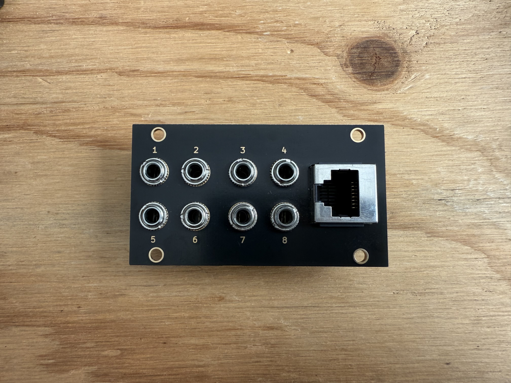

# Golden Gate(s, CV and audio) Bridge
## A bit about the project
The Golden Gate(s, CV and audio) Bridge (a.k.a. GGB) is DIY eurorack project in Intellijel 1U (14HP) that passively bridges two set-ups over ethernet. It was created for modular enthusiasts, but just as handy for electronic musicians trying to build efficiency into the music set-ups. Each module is passive (i.e. requires no power) and easy to put together, even for beginners.

With each GGB pair you can route 8 channels of inputs/outputs of gates, CVs or audio over ethernet.

I built the GGB as it was taking me 30 mins every show to plug audio from my modular to my mixer and CV and gates from my external MIDI to CV converter. It also made making music on my modular difficult as I either had to commit to it being set up and taking up space on my desk, or leave my equipment packed up.

Ethernet ports can also be added to your own DIY equipment, if so inclined. I've used [these panel mount RJ45 connectors](https://au.element14.com/cliff-electronic-components/cp30222s/ftp-adaptor-rj45-jack-8p8c-cat6/dp/2491571?CMP=i-55c5-00001621) with a sacrificial CAT6A cable in the enclosure spliced to all the connection points. More info on this below.

If you don't want to build something like this yourself, then I highly suggest looking at Intellijel's [Octalink 1U](https://intellijel.com/shop/eurorack/1u/octalink-1u/) or Doepfer's [A-180-9 Multicore](https://doepfer.de/A1809.htm). I haven't tested, but the GGB is likely compatible with the Octalink and the A-180-9 Multicore. The sequence of the ins/outs may be different.

## 1590A Pedal Enclosure
The PCB has been made so that it can also fit inside the popular Hammond 1590A pedal enclosure. This opens up a whole lot more opportunities besides simply linking two eurorack cases. For example, I've created two sets of pedal enclosure bridges so I can quickly re-patch my modular from my (1) live mixer set-up to my (2) studio recording interface. This way I can re-patch to multi-track recording without much effort if inspiration has struck.

# BOM Notes
An Octopart BOM can be found [here](https://octopart.com/bom-tool/3J50GlHH).

I've included additional options to source parts in the notes of the BOM from Tayda, who don't show up in the Octoparts' suppliers.

Some notes on the parts:
- The PJ-3001F from Tayda are a more economical option than Thonkiconn jacks. Either work fine with the PCB design. If ordering Tayda, be sure to order more than the exact number required. I've found those jacks to be less reliably manufactured.
- Shielded RJ45 cables are needed for the bridges to work. CAT6A or higher. I've run my personal set-up on CAT6A without any issue, but have read that CAT7 or CAT8 cables may give better results because of their separately shielded wire pairs.
- 1590A enclosures are only required if you're intending to connect to a set-up outside of a eurorack case. Otherwise ignore and order more panel PCBs.

Depending on sourcing of parts, pricing can differ. A pair of GGBs costs around AUD$22.50 as of Feb 2025 (excluding postage).

# Ordering PCBs
Zip folders containing the gerber files to order your own PCBs are provided [here](pcbs). What is here should suit all PCB manufacturers, but these designs have only been tested with PCBWay.

Notes on PCB specs:
- I've printed both the panel and PCB in standard 1.6mm thickness. Both boards are quite small and don't flex much, but you could print thicker if you plan to be heavy-handed with your boards. Vertical clearance on the Shielded RJ45 connector (J9) should be fine up to 2mm, although this hasn't been tested.
- Spare the health of yourself and the environment and pick LeadFree HASL for the Surface Finish. I print just the panel in gold ENIG surface finish, which gives the copper labelling and outline the gold look. I think it looks pretty cool, but adds a lot more to the cost. There's no benefit to printing with ENIG surface finish besides superficial.
- *Note:* Be sure to specify to remove mark on PCB for your order of the panel. If not, you might end up with a job number on the front of your panel.

# PCB Designs
Files have been provided to edit the designs as you wish. Feel free to do as you wish within the license. e.g redesign as a standard 3U module or change labelling to something custom for your set up. Please note: if you're updating the labelling, be sure to update the F.Cu *AND* the F.Mask layers. You might notice that I made this mistake in the modules pictured where the numbers are in "stealth mode". This has been updated in the files provided. Below is an example of what this looks like. *Note*: This is before I rotated the RJ45 connector 90 degrees.

# Build Notes
Before soldering:
1. Place all jacks on the PCB (J1-8). *Note:* All jacks share a padded through-hole for GND on the PCB.
2. Place panel over the jacks. This might take some wiggling. If the jacks are completely flush with the panel, don't worry, they should be after the next step.
3. Place washers and screw nuts onto the jacks. *Careful*, the circuit PCB might feel secure, but it can definitely still fall off from the jacks' pins.
4. Through the PCB, place the Shielded RJ45 connector (J9). Be sure to push it through so that its black mounting tabs push through the PCB. The connector's little black "wings" should sit just on-top of the panel.
5. If you're happy with how everything is sitting, start soldering!

Notes for 1590A version builders:
- If you've never done this before, watch [this video](https://www.youtube.com/watch?v=CYmyW8S2dC8&ab_channel=StompBoxParts).
- A [drill plot](files/GGB_drillplot.pdf) has been provided if you're drilling your own enclosure. Make sure the scale of the print is correct by comparing the measurement references with a trusty ruler. Print this out and stick it to the top of your enclosure.
- For the square hole for the Shielded RJ45 connector (J9), you can take out most of the material with a stepped drill bit and square the corners with a square file (something around 10-15mm wide that will remove a resonable amount of material). *Just a note* that the hole might look square, but it's 1mm taller than it is wide. Height: 16.9mm x Width: 15.9mm. If you have a Dremel, that works great with a wheel cutter. Just be sure not to over-cut the corners. Making this square hole is by far the most difficult part. Just take your time and keep measuring to make sure you haven't taken too much material off.
- Drill your enclosure before fitting your parts and soldering the PCB.

# Schematics
Design files for customisation provided as a .zip of an archived Kicad project. Created in Kicad version 9.0.0. Earlier versions of Kicad may have issues opening the project. See [here](files).

# Ethernet Wiring
If you decide to add a panel-mount RJ45 connector to your own equipment as described above, the following cable colour and pin numbering should work. Always confirm with a multimeter.

| Channel/Pin | Wire color |
|---|---|
| 1 | White and red |
| 2 | Red |
| 3 | White and green |
| 4 | Blue |
| 5 | White and blue |
| 6 | Green |
| 7 | White and brown |
| 8 | Brown |
